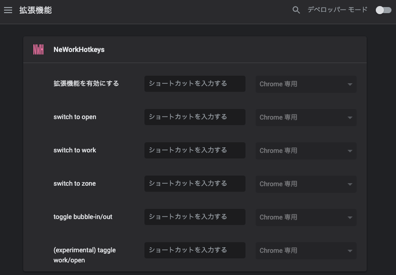

# NeWorkHotkeys

## 概要

NeWork 専用のホットキー拡張

## 仕組み

- ボタンに該当する要素の click イベントを発火

## ショートカットの設定

1. `chrome://extensions/shortcuts` にアクセス
2. 各種お好みのショートカットを設定
    - (experimental) `グローバル` 選択で他のタブ, ウィンドウ, アプリ操作中もショートカットが有効
3. NeWork を開いていたらページを reload

## ワーク/オープン 時の効果音

設定から有効/無効の切り替えが可能です

※ デフォルト: 有効

